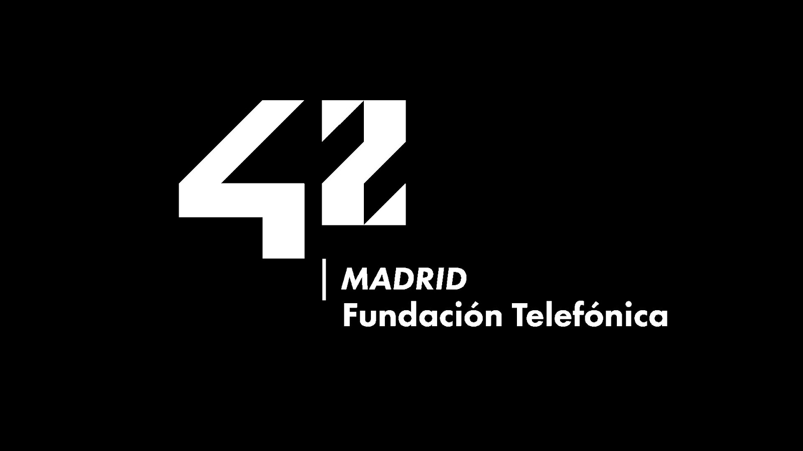
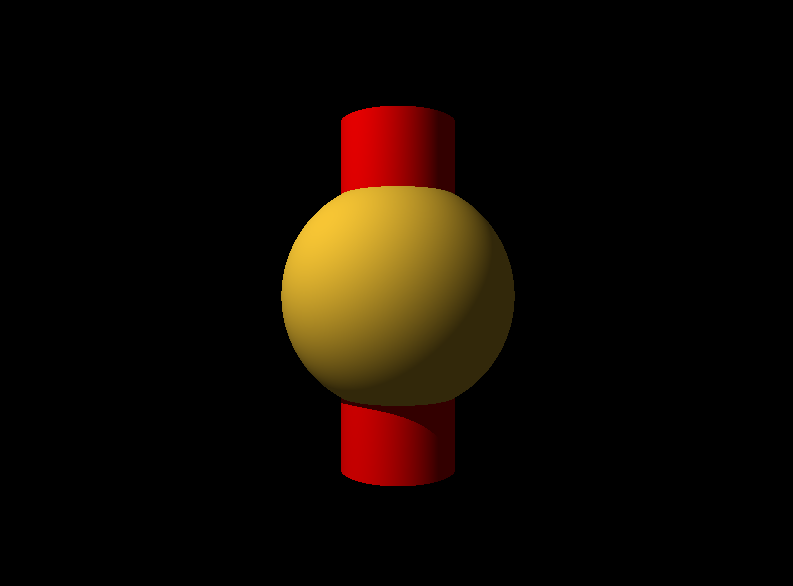

# Minirt

The Minirt project is a part of the 42 School curriculum where students
create a simplified version of a ray tracer. The goal is to understand how 
to implement complex mathematical algorithms.

## Project Overview



> 42 Madrid is an academy for values, attitude and learning "hard and soft skills" in the digital environment.
MiniRT is a graphics engine that renders 3D scenes using the Ray Tracing algorithm, built from scratch in C.

It provides a hands-on introduction to the mathematical foundations of computer graphics, including vector operations, lighting models, and geometric transformations.

Developed by JohnnyCPP and igenez-y.

- Ray Tracing Rendering: Simulates the path of light by casting rays from the camera through each pixel to accurately render shadows, reflections, and material properties
- Primitive Intersection: Computes ray intersections with fundamental geometric shapes, including planes, spheres, and cylinders
- Camera Transformations: Implements translation to position the camera within the 3D world and rotation to control its orientation (pan, tilt, and roll) via the viewing coordinate system
- Ambient, Diffuse, and Specular Lighting: Implements the Phong reflection model to simulate realistic lighting effects based on light sources and material properties

## Run

Clone the repository and run the following make targets:

```bash
git clone https://github.com/JohnnyCPP/42_minirt.git
cd 42_minirt
make help
make miniRT
./miniRT ./resources/scene.rt
```

The default scene with a sphere and a cylinder should look similar to the following example:
:w

